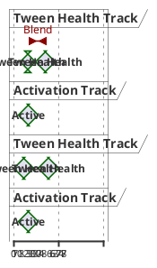

## File: [Assets/Day08/Day08Timeline.playable](Assets/Day08/Day08Timeline.playable)

```plantuml
@startuml

concise "Tween Health Track" as T01
concise "Activation Track" as T02
concise "Tween Health Track" as T03
concise "Activation Track" as T04

@0
@677

@T01
102 is "Tween Health"
@334 <-> @402 : Blend
334 is "Tween Health"
634 is {hidden}

@T02
78 is "Active"
378 is {hidden}

@T03
0 is "Tween Health"
300 is {hidden}
378 is "Tween Health"
678 is {hidden}

@T04
78 is "Active"
378 is {hidden}

@enduml
```

