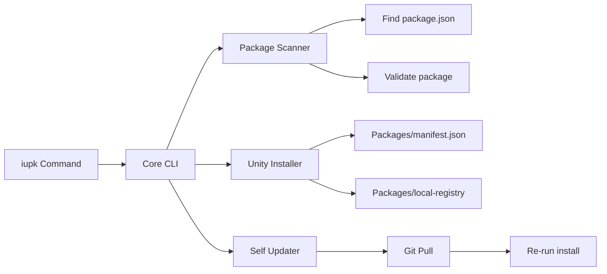

# Plan: iupk (Unity Package) - Unity Package Installer Tool

## Summary
Create a cross-platform CLI tool `iupk` that installs Unity packages from local folder paths. The tool will be distributed as a standalone .NET application with one-command installation.

## Architecture Overview



## Steps

### 1. Create PackageSmith Solution Structure

**Create new repo structure:**

```
packagesmith/
├── src/
│   ├── PackageSmith/
│   │   ├── PackageSmith.csproj
│   │   ├── Program.cs
│   │   └── Commands/
│   │       ├── InstallCommand.cs
│   │       ├── ListCommand.cs
│   │       ├── RemoveCommand.cs
│   │       └── UpdateCommand.cs
│   └── PackageSmith.Core/
│       ├── PackageSmith.Core.csproj
│       ├── Models/
│       │   ├── UnityPackage.cs
│       │   └── Manifest.json
│       ├── Services/
│       │   ├── IPackageScanner.cs
│       │   ├── PackageScanner.cs
│       │   ├── IUnityProjectFinder.cs
│       │   └── UnityProjectFinder.cs
│       └── Json/
│           └── ManifestReader.cs
├── install.ps1
├── install.sh
├── uninstall.ps1
├── uninstall.sh
├── README.md
└── PackageSmith.sln
```

### 2. Develop install.ps1 (Windows)

**Features:**
- Check .NET SDK 8.0+ installation
- Prompt to install via winget if missing
- Build solution in Release mode
- Create shim (`.cmd` file) to `~/.iupk/`
- Add shim location to PATH (persistent)
- Verify installation

**Key PowerShell operations:**
```powershell
# Check dotnet
$dotnetVersion = dotnet --version 2>&1

# Build Release
dotnet build src/PackageSmith -c Release

# Create shim directory
$shimDir = "$env:USERPROFILE\.iupk"
New-Item -ItemType Directory -Path $shimDir -Force

# Create shim
@"
@echo off
"$shimDir\PackageSmith.exe" %*
"@ | Out-File -FilePath "$shimDir\iupk.cmd" -Encoding ASCII

# Add to PATH (Machine level requires admin, User level preferred)
[Environment]::SetEnvironmentVariable(
    "Path",
    "$env:Path;$shimDir",
    "User"
)
```

### 3. Develop install.sh (Linux/Mac)

**Features:**
- Check `dotnet` command availability
- Build solution in Release
- Symlink binary to `/usr/local/bin/iupk` (requires sudo)
- Fallback: Modify `~/.bashrc` or `~/.zshrc`

**Key Bash operations:**
```bash
#!/bin/bash

# Check dotnet
if ! command -v dotnet &> /dev/null; then
    echo "Error: .NET SDK not found"
    exit 1
fi

# Build
dotnet build src/PackageSmith -c Release

# Install to ~/.local/share/iupk
INSTALL_DIR="$HOME/.local/share/iupk"
mkdir -p "$INSTALL_DIR"
cp src/PackageSmith/bin/Release/net8.0/PackageSmith "$INSTALL_DIR/iupk"

# Symlink to /usr/local/bin (with sudo)
sudo ln -sf "$INSTALL_DIR/iupk" /usr/local/bin/iupk

# OR add to PATH in shell config
echo 'export PATH="$HOME/.local/share/iupk:$PATH"' >> ~/.bashrc
```

### 4. Implement Core CLI Commands

**InstallCommand.cs:**
```csharp
[Command("install")]
[Description("Install a Unity package from local path")]
public class InstallCommand
{
    [Argument(0)] string Path { get; }

    [Option("p|--project")] string ProjectPath { get; }

    // Find nearest Unity project
    // Copy package to Packages/
    // Update Packages/manifest.json
}
```

**UpdateCommand.cs:**
```csharp
[Command("update")]
[Description("Update iupk to latest version")]
public class UpdateCommand
{
    // git pull latest
    // Re-run install script
}
```

### 5. Add Self-Update Verification

**Self-update flow:**
1. Detect if running from git repo or installed binary
2. If installed: check GitHub releases for new version
3. If dev: run `git pull` and rebuild

## Testing Strategy

1. Test install scripts on Windows, Mac, Linux
2. Verify PATH modification persists across sessions
3. Test package installation in Unity project
4. Test self-update command

## Future Enhancements (Phase 2+)

- Package registry support (npm-style local registry)
- Package versioning
- Dependency resolution
- Package removal command
